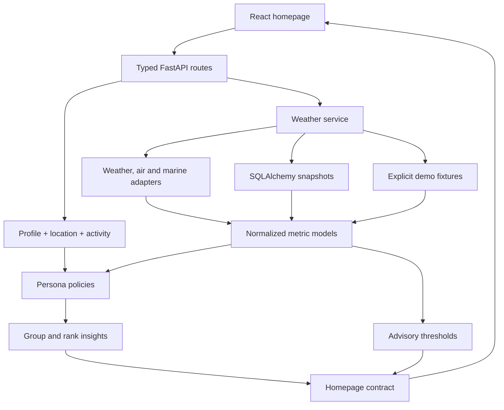

# Architecture

The browser owns device preferences, selected/saved cities and in-app reminder history. The API owns weather normalization, provider fallbacks, scoring, recommendation generation and advisories. SQLAlchemy stores bounded weather snapshots. No user identifier is stored with weather requests.

## Backend layers

- `schemas/weather.py`: Pydantic location, profile, metric, forecast, recommendation, advisory and homepage contracts.
- `providers/base.py`: weather, air, marine, location, alert and traffic protocols. Legacy official-alert/traffic placeholders remain; active optional integrations are in `providers/extras.py`.
- `api/planner.py`: validated POST journey and tide requests; endpoint timezones and coverage handling.
- `providers/extras.py`: optional traffic, tides and airport bulletins with no frontend credentials.
- `recommendations/planning.py`: complete-period screening, fitness sessions, event comfort, school schedules and sourced planting calendars.
- `providers/open_meteo.py`: HTTP transport and provider normalization. Metrics are normalized before display. Airport bulletins are intentionally shown as raw METAR/TAF text alongside source and validity metadata.
- `services/weather.py`: parallel optional providers, weather fallback, in-flight deduplication, persistent cache and safe missing-data behavior.
- `recommendations/policies.py`: persona-specific interpretation functions. No UI logic.
- `personalization/engine.py`: grouping, ranking, freshness gating and homepage composition.
- `alerts/engine.py`: advisory generation separated from recommendations.
- `database/store.py`: PostgreSQL-compatible weather snapshot cache with atomic updates. Cache failures do not prevent live weather responses.

## Frontend

React 18 and JavaScript, Vite, Tailwind CSS 3 plus centralized custom CSS. Component boundaries separate onboarding, locations, personas, forecast, insights, explanation and Judge Mode. A query-dependent hook aborts obsolete requests, prevents mixing cities/profiles and saves only the last exact-query response for offline access. `localStorage` can be cleared in Preferences.

## Tradeoffs

No account-based persistence was required to use the homepage, so private preferences stay on the device. A server account-sync feature would require real identity, authorization, relational ownership constraints and migrations before exposing CRUD endpoints. The current process-local rate limiter and request deduplication target a single backend instance; scale-out requires shared infrastructure.
