# 🌦️ Mausam Setu (मौसम सेतु) · 3.0

<div align="center">

**One Forecast. Different Users. Better Decisions.**

*An intelligent, explainable, and safety-first personalized homepage prototype for the official **Mausam** mobile application.*

[](https://www.python.org/)
[](https://fastapi.tiangolo.com/)
[](https://nodejs.org/)
[](https://react.dev/)
[](https://vitejs.dev/)
[](https://developer.mozilla.org/en-US/docs/Web/Progressive_web_apps)
[]()
[]()
[]()

<br />

> **Problem Statement (SIH26076)**: *Development of personalized homepage for “Mausam” mobile application*  
> **Target Entity**: Ministry of Earth Sciences (MoES) / India Meteorological Department (IMD)  
> **Status**: Independent production-grade prototype with headless native API integration contracts.

</div>

---

## 📱 Quick Preview

<div align="center">

| 🖥️ Desktop Personalized Dashboard (1440px) | 📱 Small-Screen Mobile PWA (390px) |
| :---: | :---: |
| 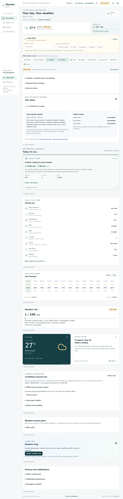 | 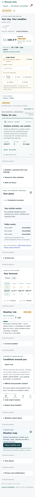 |
| *Dynamic widget layout tailored for a Fitness + Health profile* | *Collapsible disclosures, thumb-friendly navigation, zero overflow* |

</div>

---

## 📑 Table of Contents

- [🌟 Executive Summary: Why Mausam Setu?](#-executive-summary-why-mausam-setu)
- [📸 Visual Feature Tour & Screenshot Showcase](#-visual-feature-tour--screenshot-showcase)
  - [1. Dynamic Personalized Homepage](#1-dynamic-personalized-homepage)
  - [2. Transparent Explainability Engine ("Why this for me?")](#2-transparent-explainability-engine-why-this-for-me)
  - [3. Safety-First Architecture & Emergency Override](#3-safety-first-architecture--emergency-override)
  - [4. Multi-Persona Activity Planning Center](#4-multi-persona-activity-planning-center)
  - [5. Interactive Live Weather Map Explorer](#5-interactive-live-weather-map-explorer)
  - [6. Multilingual AI Voice Assistant ("Ask Mausam")](#6-multilingual-ai-voice-assistant-ask-mausam)
  - [7. Crowdsourced Ground Truth & Community Flood Reports](#7-crowdsourced-ground-truth--community-flood-reports)
  - [8. Multi-Location Management & Saved Places](#8-multi-location-management--saved-places)
  - [9. Data Transparency, Provenance & Unit Customization](#9-data-transparency-provenance--unit-customization)
  - [10. Offline-First Resilience & PWA Shell](#10-offline-first-resilience--pwa-shell)
  - [11. Honest Missing-Data State Handling](#11-honest-missing-data-state-handling)
- [👥 Supported Personas & Decision Engine](#-supported-personas--decision-engine)
- [🏗️ System Architecture & Data Pipeline](#️-system-architecture--data-pipeline)
- [🔌 Native Mausam Integration (`/api/integration/v1/context`)](#-native-mausam-integration-apiintegrationv1context)
- [⚡ Quick Start Guide](#-quick-start-guide)
  - [One-Click Startup](#one-click-startup)
  - [Manual Terminal Startup](#manual-terminal-startup)
- [🧪 SIH Evaluator Walkthrough (Judge Mode)](#-sih-evaluator-walkthrough-judge-mode)
- [✅ Verification, Testing & Quality Assurance](#-verification-testing--quality-assurance)
- [🗺️ Codebase Map](#️-codebase-map)
- [🛡️ Ethical Boundaries & Honest Disclosures](#️-ethical-boundaries--honest-disclosures)

---

## 🌟 Executive Summary: Why Mausam Setu?

Traditional weather applications treat all citizens identically. A standard forecast displays **38°C, 70% humidity, and 15 km/h winds**—a set of passive numbers leaving the user to figure out what to do.

**In reality, weather is experienced through context:**
- An **outdoor athlete** needs to know if morning heat index and UV risk allow a safe 10 km run.
- A **farmer** needs soil moisture levels (0–1 cm vs. 3–9 cm depth), rainfall predictions, and crop spraying windows.
- A **parent or school student** needs comfort ratings during morning drop-off, midday play, and afternoon pickup.
- An **asthmatic or sensitive citizen** needs particulate matter (PM2.5, PM10) and air quality thresholds.
- A **commuter** needs rain forecasts along route geometry and travel time buffers.
- A **coastal fisherman** needs wave height, wave period, and tidal outlooks.

**Mausam Setu (मौसम सेतु — "The Weather Bridge")** answers the single question that matters most:  
> **“What does this weather mean for *me*, and what should I do right now?”**

### The Core Architectural Pillars

1. **Deterministic Safety-First Priority**: Weather risk and official alerts are never hidden or ranked down by machine learning or personal preferences. Life safety always takes absolute precedence.
2. **Transparent Explainability**: Every recommendation discloses the exact atmospheric factors, mathematical formula breakdown, data origin, and validity window. No black-box hallucinations.
3. **Multi-Persona Layout Engine**: Dynamically re-orders and synthesizes sections based on 10 user personas, schedule preferences, and on-device bounded feedback.
4. **Integration Ready for Official MoES / IMD Apps**: A headless contract (`GET /api/integration/v1/context`) serves structured, framework-independent JSON widgets directly ready for native Android (Kotlin) or iOS (Swift) clients.

---

## 📸 Visual Feature Tour & Screenshot Showcase

### 1. Dynamic Personalized Homepage
*One Weather Forecast. Completely Different Perspectives.*

<div align="center">
  
</div>

#### What You See:
- **Compact Hero Meteorological Overview**: Instant display of temperature (27°C / 38°C), feels-like index, atmospheric condition, and real-time localized Weather Risk summary (1/100 · Low).
- **Persona Selector Chips**: Instant toggle between 10 specialized profiles (Student, Hill/Highland, Health, Fitness, Travel, Family, Agriculture, Commute, Marine, Events).
- **Intelligent Top-Pick Recommendation**: Highlighting the single most timely decision (e.g., *"A better window to head outside: 6:00 am – 7:00 am"* based on heat index, UV, wind, and daylight screening).
- **Interactive Feedback Controls**: On-device "Useful" / "Not Useful" controls that fine-tune local scoring weights without cloud tracking.
- **Dynamic Section Ordering**: Homepage sections re-order automatically based on user interests—farming soil panels surface to the top for farmers, while commute routes surface for travelers.

---

### 2. Transparent Explainability Engine ("Why this for me?")
*Eliminating Black-Box AI — Total Algorithmic Accountability.*

<div align="center">
  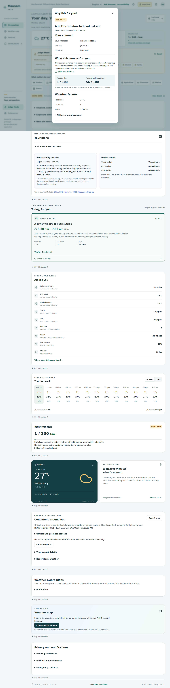
</div>

#### What You See:
- **User Context Verification**: Shows active personas (Fitness + Health), scheduled activity, and geographical location.
- **Risk vs. Relevance Decoupling**: Explicitly separates **Weather Risk (1/100)** from **Personalized Relevance (56/100)**. High relevance does *not* imply safety; low risk does *not* mean the weather matches your activity.
- **Measured Atmospheric Factors**: Lists exact sensor readings that triggered the rule (Feels like 27°C, UV Index 4, Wind 12 km/h).
- **Mathematical Score Breakdown**: Inspectable score components showing baseline weight, time relevance, and sensitivity contributions.

---

### 3. Safety-First Architecture & Emergency Override
*When Danger Arrives, Preferences Yield to Life Safety.*

<div align="center">
  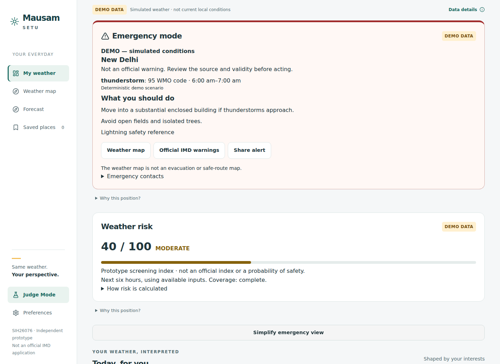
</div>

#### What You See:
- **Mandatory First-Position Override**: Under extreme weather conditions (WMO 95 Thunderstorm, heatwaves, cyclones, or official IMD alerts), the system promotes **Emergency Mode** above all personalized sections.
- **Actionable Emergency Protocols**: Immediate instructions (e.g., *"Move into a substantial enclosed building. Avoid open fields and isolated trees"*).
- **Direct Safety Actions**: One-click shortcuts to official warnings, external weather maps, emergency contact lists, and community alert sharing.
- **Clear Visual Hierarchy**: Distinct severity rules without distracting neon animations or anxiety-inducing flashing.

---

### 4. Multi-Persona Activity Planning Center
*Intelligent Temporal Screening for Everyday Decisions.*

<div align="center">
  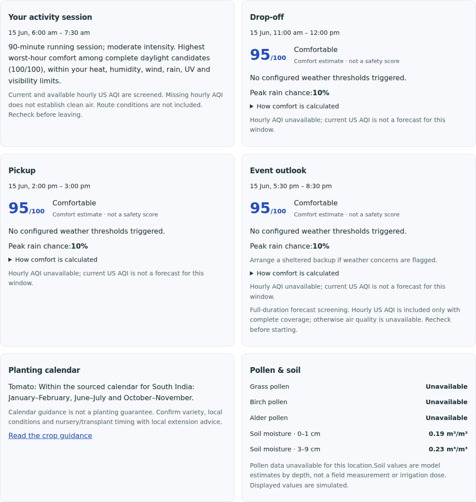
</div>

#### What You See:
- **Fitness Session Screening**: Evaluates daylight availability, temperature curve, humidity, and UV levels to discover the single best 60–90 minute workout window (e.g., 6:00 am – 7:30 am).
- **School Drop-Off & Pickup Comfort**: Computes localized comfort scores (e.g., **95/100 · Comfortable**) for morning (11:00 am) and afternoon (2:00 pm) school transits with rain chance screening.
- **Event & Commute Outlook**: 3-hour evening window analysis with sheltered backup warnings.
- **Agricultural Planting Calendar**: Sourced regional planting guidance (e.g., Tomato planting windows for South India) combined with gridded root-zone soil moisture metrics (0–1 cm and 3–9 cm depth).

---

### 5. Interactive Live Weather Map Explorer
*Integrated Windy GIS Overlays Centered on User Coordinates.*

<div align="center">
  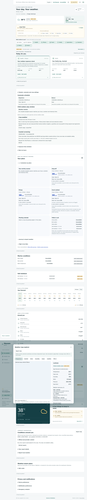
</div>

#### What You See:
- **Multi-Layer Meteorological Layers**: Direct access to Temperature, Rainfall, Wind, Humidity, Live Radar, Satellite, and PM2.5 air quality maps.
- **Bandwidth & Data Awareness**: Automatically loads on intentional user action; honors **Low Data Mode** to prevent high-bandwidth consumption on rural 2G/3G networks.
- **Spatial Context**: Coordinated with the user's active geographic location with fallback links for independent inspection.

---

### 6. Multilingual AI Voice Assistant ("Ask Mausam")
*Natural Language Weather Guidance in Hindi and English.*

<div align="center">
  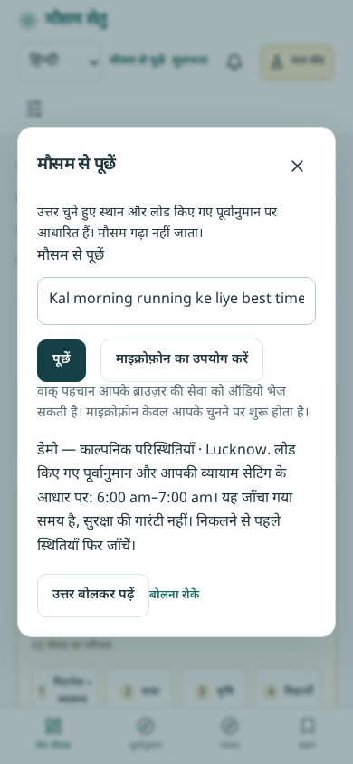
</div>

#### What You See:
- **Native Devanagari Typography**: Bundles clean local fonts with complete Hindi localization (मौसम से पूछें).
- **Speech & Text Interaction**: Supports browser microphone speech recognition and text queries.
- **Hallucination-Free Computation**: When asked *"Kal morning running ke liye best time kya hai?"* (What is the best time for running tomorrow morning?), it calculates the answer directly from tomorrow's hourly forecast model (6:00 am – 7:00 am) rather than querying an ungrounded LLM.
- **Text-to-Speech Output**: Integrated speech synthesis reads guidance aloud for low-literacy or vision-impaired accessibility.

---

### 7. Crowdsourced Ground Truth & Community Flood Reports
*Hyper-Local Citizen Observations with Privacy & Verification.*

<div align="center">
  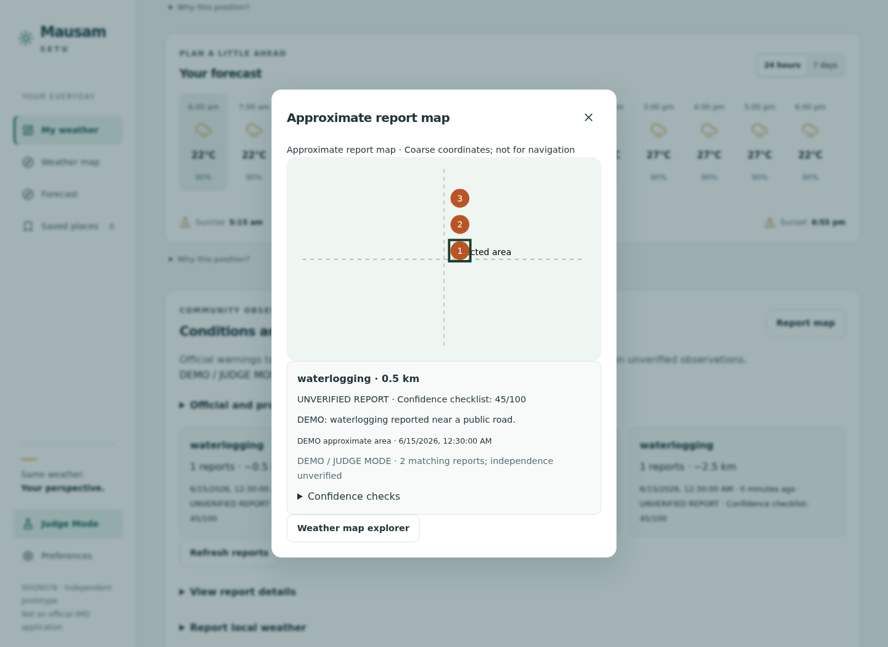
</div>

#### What You See:
- **Hyper-Local Field Reports**: Waterlogging, localized flooding, blocked drains, and fallen trees reported directly by citizens.
- **Privacy-Preserving Coordinate Fuzzing**: Coordinates are rounded to city-area grids to prevent residential surveillance.
- **Confidence Scoring Matrix**: Every submission receives an algorithmic confidence checklist score (e.g., 45/100) based on timestamp freshness, provider weather corroboration, and photo inspection.
- **Project Reviewer State**: Clear demarcation between verified community observations and unverified citizen submissions.
- **Receipt-Based Deletion**: Cryptographic tokens allow users to edit or delete their submissions without requiring cloud accounts.

---

### 8. Multi-Location Management & Saved Places
*Seamless Switching Across Multiple Cities and Micro-Climates.*

<div align="center">
  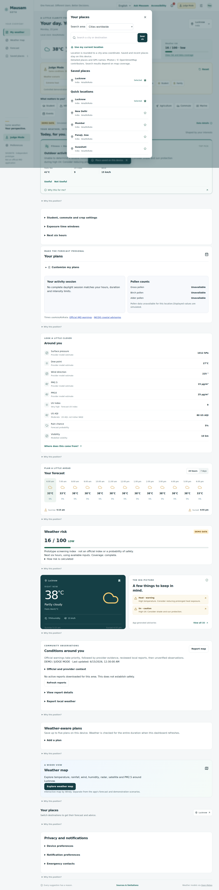
</div>

#### What You See:
- **Fast Geocoding Search**: Powered by OpenStreetMap Photon geocoder with offline demo fallbacks.
- **Quick-Access Switcher**: Instant switching between saved destinations (Lucknow, New Delhi, Mumbai, Panaji, Guwahati).
- **Per-Location State**: Saved places maintain individual preferences, schedules, and active advisory tracking on the device.

---

### 9. Data Transparency, Provenance & Unit Customization
*Complete Auditability for Every Single Displayed Data Point.*

<div align="center">

| ⚙️ Preference Customization | 🔬 Granular Data Provenance |
| :---: | :---: |
| 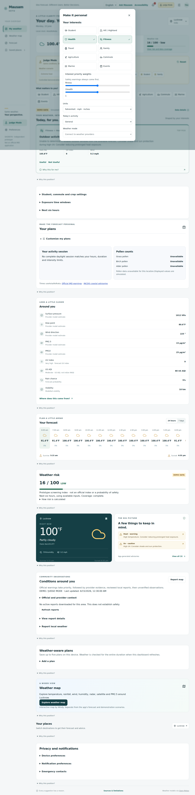 | 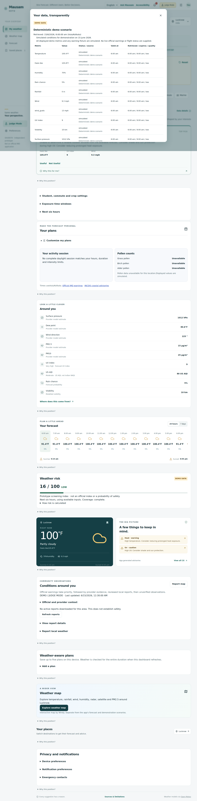 |
| *Unit toggle (°C/°F), manual persona priority sliders, and activity selectors* | *Exact provider, retrieval timestamp, validity window, and expiry per metric* |

</div>

---

### 10. Offline-First Resilience & PWA Shell
*Uninterrupted Access During Network Disruptions.*

<div align="center">

| 📴 Offline Graceful Degradation | 📅 7-Day Extended Mobile Outlook |
| :---: | :---: |
| 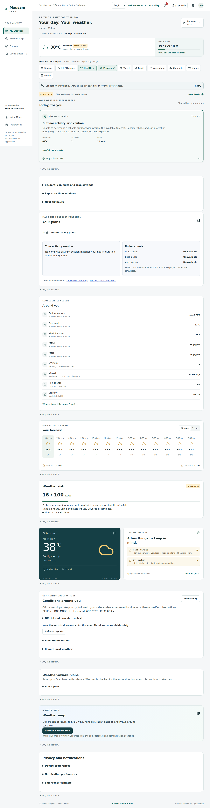 | 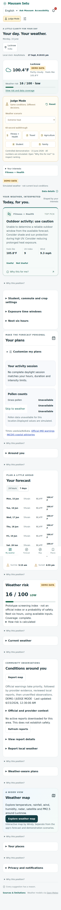 |
| *Transparent "Offline - showing last saved data" banner with offline cached responses* | *Thumb-friendly 7-day extended forecasts with zero horizontal overflow* |

</div>

---

### 11. Honest Missing-Data State Handling
*Never Fabricating or Hallucinating Data When Feeds Fail.*

<div align="center">
  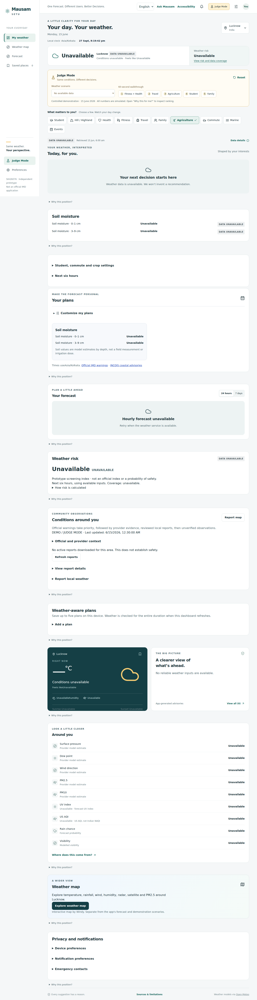
</div>

> **Integrity Guarantee**: When weather feeds fail or sensor data is missing, Mausam Setu refuses to guess or fabricate numbers. It displays an explicit **"Weather data is unavailable. We won't invent a recommendation"** state, preserving scientific credibility.

---

## 👥 Supported Personas & Decision Engine

Mausam Setu implements 10 distinct user profiles, allowing the same atmospheric conditions to generate tailored insights:

| Persona | Primary Focus | Weather Triggers Evaluated | Tailored Action |
| :--- | :--- | :--- | :--- |
| 🏃 **Fitness & Athletics** | Running, cycling, gym | Wet-bulb heat, UV index, wind resistance, AQI | Identifies optimal workout hours; warns on midday heat stroke danger |
| 🌾 **Agriculture & Farming** | Crops, sowing, irrigation | Soil moisture (0-1cm, 3-9cm), rain probability, wind gusts | Alerts on spraying drift risk; advises whether irrigation can be skipped |
| 🎓 **Student & Education** | School transit, sports | Departure temperature, rain at dismissal, midday heat | Prepares umbrellas; recommends indoor physical education during peak UV |
| 🚗 **Commuter & Transit** | Daily travel, road safety | Precipitation along routes, visibility, waterlogging | Flags route delays; suggests departure buffers for heavy rain |
| 👨‍👩‍👧 **Family & Play** | Children, elderly safety | Thermal comfort, sunset time, park suitability | Identifies safe outdoor playground hours before heat/dusk |
| 🌊 **Marine & Coastal** | Fishing, boating, beach | Wave height, wave period, sea temperature, tides | Evaluates small-craft safety; highlights tidal extremes |
| 🫁 **Health & Sensitive** | Asthma, allergies, elders | PM2.5, PM10, US AQI, temperature swings | Recommends N95 masks; advises limiting outdoor exposure |
| ✈️ **Travel & Tourism** | Destination conditions | Origin vs. destination contrast, airport METAR/TAF | Packing advice (jackets, rainwear); flight departure weather outlook |
| 🏔️ **Hill & Highland** | Mountain trekking, roads | Rapid temperature drop, freezing rain, visibility | Cautions on fog/frost hazards; highlights daylight return deadlines |
| 🎪 **Event Planning** | Outdoor gatherings | Sustained rain chance, convective storms, wind thresholds | Recommends sheltered/canopy backup arrangements |

---

## 🏗️ System Architecture & Data Pipeline

Mausam Setu uses a deterministic, decoupled pipeline designed for ultra-low latency, zero data fabrication, and native app interoperability:

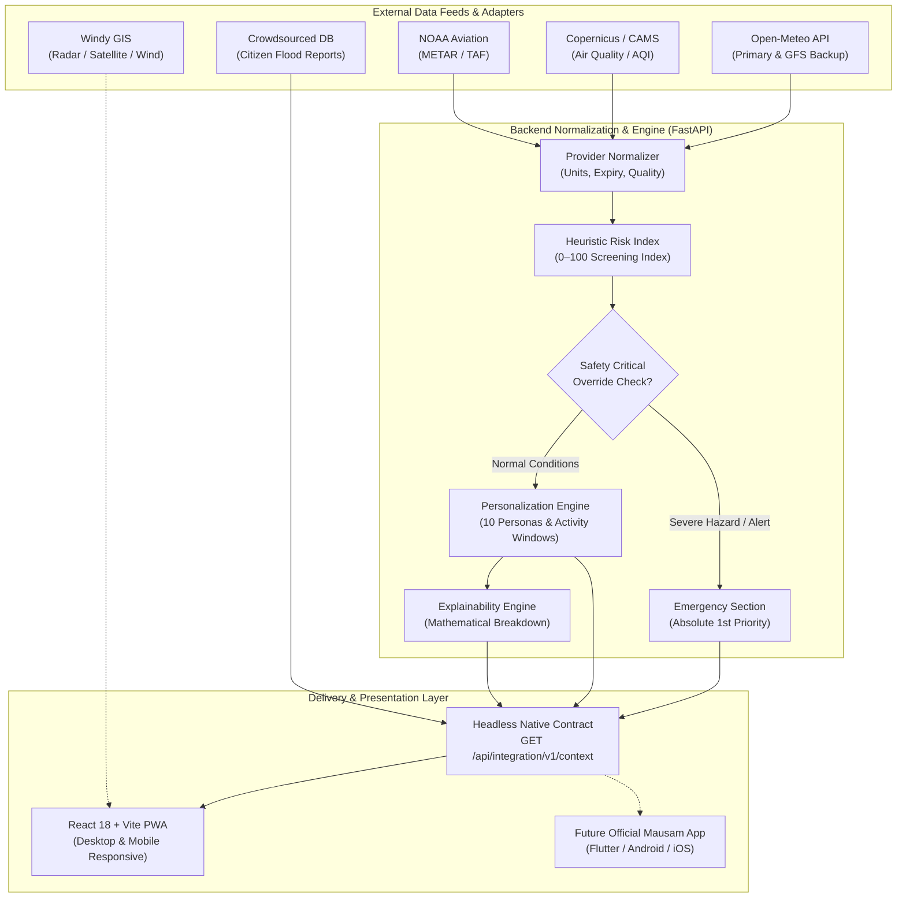

---

## 🔌 Native Mausam Integration (`/api/integration/v1/context`)

Mausam Setu was architected specifically to support the official Ministry of Earth Sciences **Mausam mobile app**. It provides a single, versioned JSON contract that returns structured widgets completely independent of HTML, CSS, or React:

### Request
```http
GET /api/integration/v1/context?latitude=26.8467&longitude=80.9462&name=Lucknow&timezone=Asia/Kolkata&interests=fitness,health&mode=live
```

### Response Schema Highlights
```json
{
  "schema_version": "1.0",
  "user_context": {
    "location": { "name": "Lucknow", "latitude": 26.8467, "longitude": 80.9462 },
    "interests": ["fitness", "health"],
    "reference_time": "2026-06-15T06:00:00+05:30"
  },
  "weather": {
    "temperature": 27.0,
    "feels_like": 27.0,
    "condition": "Partly cloudy",
    "uv_index": 4.0,
    "aqi_us": 55
  },
  "weather_risk": {
    "score": 1,
    "severity": "low",
    "summary": "Low risk for general activities"
  },
  "safety": {
    "emergency_active": false,
    "critical_hazards": []
  },
  "homepage_layout": [
    { "widget_id": "top_pick", "priority": 100, "widget_type": "recommendation" },
    { "widget_id": "activity_session", "priority": 90, "widget_type": "planning" },
    { "widget_id": "hourly_forecast", "priority": 80, "widget_type": "forecast" }
  ],
  "recommendations": [
    {
      "id": "running_window",
      "title": "A better window to head outside",
      "action": "Schedule outdoor session between 6:00 am and 7:00 am",
      "relevance_score": 56,
      "factors": { "feels_like": 27.0, "uv": 4.0, "wind_kmh": 12.0 }
    }
  ]
}
```

> **Zero Client Framework Lock-in**: A Flutter, Kotlin, or Swift developer can deserialize `homepage_layout` and render native Android/iOS cards without maintaining complex weather logic on the client device.

---

## ⚡ Quick Start Guide

### Prerequisites
- **Python**: 3.12 or later
- **Node.js**: 20.x, 22.x, or 24.x (with npm)
- **Git**

### One-Click Startup

#### 🪟 On Windows
Double-click `start-windows.bat` or run:
```cmd
start-windows.bat
```

#### 🐧 On Linux / macOS
```bash
bash start.sh
```

Once running, visit **`http://localhost:5173`** in your browser.  
FastAPI interactive Swagger documentation is available at **`http://localhost:8000/docs`**.

---

### Manual Terminal Startup

If you prefer starting the backend and frontend services in separate terminals:

#### Terminal 1 — Backend (FastAPI + Python)
```bash
cd backend
python -m venv .venv

# On Windows:
.venv\Scripts\activate
pip install -r requirements.txt
python -m uvicorn app.main:app --port 8000 --reload

# On Linux/macOS:
source .venv/bin/activate
pip install -r requirements.txt
python -m uvicorn app.main:app --port 8000 --reload
```

#### Terminal 2 — Frontend (React + Vite)
```bash
cd frontend
npm ci
npm run dev
```

---

## 🧪 SIH Evaluator Walkthrough (Judge Mode)

Mausam Setu includes an integrated **Judge Mode** designed to allow evaluators to verify the engine deterministically without waiting for real-world thunderstorms:

1. **Activate Judge Mode**: Click the **Judge Mode** toggle in the top bar.
2. **Extreme Heat Demonstration**:
   - Select **Extreme heat**. Notice how conditions update to 38°C with severe heat warnings.
   - Switch between **Fitness** and **Agriculture**: Observe how the top recommendation dynamically switches from *Heat Caution / Workout Window* to *Crop Spraying & Soil Moisture Advisory*.
3. **Inspect Explainability**:
   - Click **"Why this for me?"** on any card.
   - Review the exact atmospheric inputs, risk vs. relevance split, and score math.
4. **Emergency Priority Override**:
   - Switch weather scenario to **Emergency Mode** (or simulated official warning).
   - Verify that safety alerts immediately take position #1, overriding user preferences.
5. **Community Ground Truth**:
   - Select **Community Flood Report** to inspect citizen waterlogging reports, confidence scores (45/100), and the report map diagram.
6. **Hindi Voice Assistant**:
   - Switch language to **हिंदी**.
   - Open **मौसम से पूछें** (Ask Mausam) and ask:  
     `"Kal morning running ke liye best time kya hai?"`  
   - Inspect the calculated tomorrow-morning recommendation.
7. **Weather Map Explorer**:
   - Click **Explore weather map** to verify live Windy GIS layer synchronization.

---

## ✅ Verification, Testing & Quality Assurance

Mausam Setu maintains an exhaustive, end-to-end automated testing suite with **100% pass rates**:

| Test Suite | Commands | Checks Executed | Status |
| :--- | :--- | :--- | :---: |
| **Backend Unit & API** | `pytest -q app/tests` | **150 passed** | ✅ **PASSED** |
| **Backend Lint & Format** | `ruff check app && ruff format --check app` | Code quality & style | ✅ **PASSED** |
| **Frontend Unit Tests** | `npm test` | **18 passed** | ✅ **PASSED** |
| **Frontend Formatting** | `npm run format:check` | Prettier compliance | ✅ **PASSED** |
| **PWA Production Build** | `npm run build` | Zero-error Vite bundle | ✅ **PASSED** |
| **Playwright Browser Tests** | `npm run test:browser` | 9 multi-step checks | ✅ **PASSED** |
| **Activity Planning Suite** | `npm run test:planning` | 7 temporal checks | ✅ **PASSED** |
| **Merge Verification** | `npm run test:merge` | 6 integration checks | ✅ **PASSED** |
| **Multi-Width Viewports** | 360, 390, 412, 768, 1024, 1280, 1440, 1920 px | 10 viewports verified | ✅ **PASSED** |
| **Offline PWA Suite** | `npm run test:offline` | Cache, isolation, shell | ✅ **PASSED** |

---

## 🗺️ Codebase Map

```text
Mausam-Setu/
├── backend/
│   ├── app/
│   │   ├── api/             # FastAPI REST endpoints & native integration contract
│   │   ├── database/        # SQLAlchemy models (SQLite local, PostgreSQL ready)
│   │   ├── personalization/ # 10 personas, weighting rules, schedule algorithms
│   │   ├── providers/       # Open-Meteo, CAMS AQI, NOAA METAR, Windy adapters
│   │   ├── recommendations/ # Explainable action generation & scoring math
│   │   ├── safety/          # Heuristic risk engine & critical safety overrides
│   │   ├── services/        # Community reports, geocoding, and weather routing
│   │   └── tests/           # 150 automated pytest test suites
│   ├── requirements.txt     # Production dependencies
│   └── requirements-dev.txt # Testing & linting tools
├── frontend/
│   ├── public/              # PWA manifest, service worker, Devanagari fonts
│   ├── src/
│   │   ├── components/      # Modular UI widgets (Hero, Cards, Maps, Modals)
│   │   ├── hooks/           # Responsive hooks, offline state, speech recognition
│   │   ├── styles/          # Vanilla CSS tokens, glassmorphism, responsive grids
│   │   └── translations/    # Bilingual English / Hindi localization dictionaries
│   ├── tests/               # Playwright browser end-to-end automation scripts
│   └── package.json         # React 18 & Vite configuration
├── docs/
│   ├── INTEGRATION.md       # Native MoES/IMD mobile integration specifications
│   ├── SIH-READINESS.md     # 60-second judge walkthrough & architectural FAQ
│   ├── UI-COMPARISON.md     # Evolution and UI design token analysis
│   └── qa/                  # High-resolution screenshots and test logs
├── start-windows.bat        # 1-click Windows startup script
├── start.sh                 # 1-click Linux/macOS startup script
└── README.md                # Complete project documentation & visual guide
```

---

## 🛡️ Ethical Boundaries & Honest Disclosures

In adherence to scientific ethics and hackathon integrity guidelines:
- **Prototype Status**: Mausam Setu is an independent prototype developed for the **SIH26076** problem statement. It is not yet officially deployed inside the MoES/IMD production infrastructure.
- **Simulated Demonstration Fixtures**: Judge Mode scenarios (extreme heat, thunderstorms, community reports) use explicitly labeled demo fixtures dated 15 June 2026.
- **Air Quality Standards**: US AQI is currently provided by CAMS and clearly noted as distinct from the Indian National Air Quality Index (NAQI).
- **Safety Boundaries**: Prototype environmental risk screenings do not constitute medical diagnoses, certified evacuation orders, or flight delay predictions.
- **Privacy First**: User preferences, saved places, and activity schedules stay entirely on the local device. No user tracking or cloud account registration is required.

---

<div align="center">

**Developed with ❤️ for Smart India Hackathon 2024 · Ministry of Earth Sciences / IMD**  
*Mausam Setu: Bringing clarity, relevance, and safety to every forecast.*

</div>
